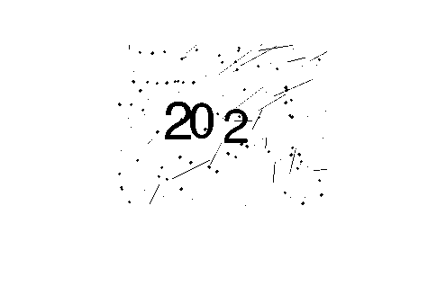
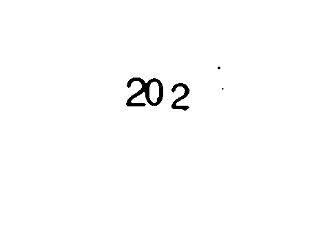
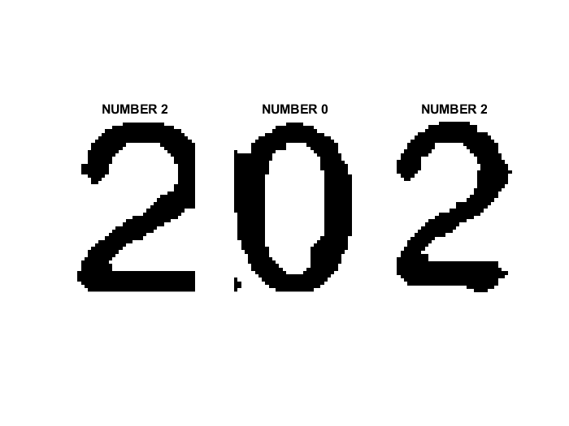

# 数字验证码识别

> 这是一个对有噪声的三位验证码进行识别的Matlab程序。我们期望这个程序可以自动识别一个包含有三个数字的噪音图像中的数字。输入是如下图所示的一些验证码，输出是[2,0,2]。

[English Introductions](README.md)

在这个例子中，我们介绍了对数字图像进行基本的预处理，以及基于CNN的分类器编写。

 

 这些图像看起来像是Google CAPTCHAs， 或者是许多网站都有的验证码。

在名为‘imagedata’的文件夹里，我们一共1200个和上图类似的图像。他们的标签在文件'lables.txt'中。

具体来说，我们将在给定的测试脚本要求下，编写明文my_classifier.n的Matlab脚本。

## 环境

请确保你已经成功安装[Matlab](https://www.mathworks.com/products/matlab.html ) 和 [Image Processing Toolbox](https://www.mathworks.com/products/image.html)在你的电脑. 

## 立刻运行！

1. 创建名为 ‘labeledImage’ 的文件夹and 运行 ‘DeNoise.m’。
2. 创建名为 SplitLabeledImage’ 的文件夹，并在它下面创建名为‘0’,，‘1’ ，‘2’的三个文件夹（注意文件夹名不包括     ‘   ’  ）。然后 运行 ‘Split.m’。
3. 运行 ‘trainer.m’ 来得到一个训练好的网络，程序会将其保存在 ‘net.mat’文件。
4. 运行 ‘evaluate_classifier.m’ 。

## 它是如何工作的

0. 原始图像是这样的 
   

1. 我们首先将其转换成binary image。  
    

2. 然后我们用 i`mclose`  去降噪。
    

3. 我们将降噪后的图像分割成三个大小相同的子图片。每个图里包含一个数字。
    
4. 我们对所有的图像做这样的操作，并把他们保存在文件夹SplitLabeledImage的子文件夹`0` , `1` , `2` 
5. 我们设计如下的CNN网络结构

   ```matlab
   layers = [
       imageInputLayer([50 35 1])
       
       convolution2dLayer(3,8,'Padding','same')
       batchNormalizationLayer
       reluLayer
       
       maxPooling2dLayer(2,'Stride',2)
       
       convolution2dLayer(3,16,'Padding','same')
       batchNormalizationLayer
       reluLayer
       
       maxPooling2dLayer(2,'Stride',2)
       
       convolution2dLayer(3,32,'Padding','same')
       batchNormalizationLayer
       reluLayer
       
       fullyConnectedLayer(3)
       softmaxLayer
       classificationLayer];
   ```
5. 为预处理测试数据编写脚本，使得我们的分类器能够对测试数据处理. 在我们的程序里，这个脚本名叫 `myclassifier.m`.
6. 最后 在 `evaluate_classifier.m`, 我们评测了我们的训练器. 注意，你可能已经发现我们的代码里用了训练数据进行测试，这是不合理的。它只是告诉你评测脚本应该长什么样，你应该将测试数据集的路径修改成你自己的测试数据目录。


